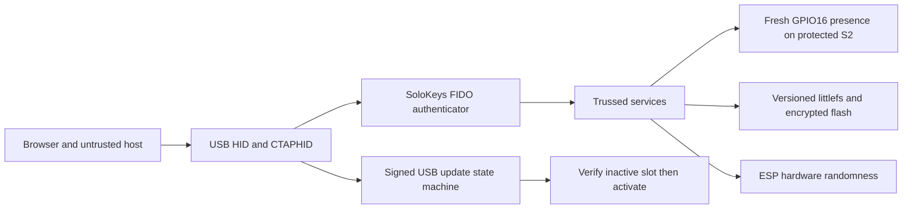

# Architecture decisions

## Fixed boundaries

- SoloKeys/Trussed owns CTAP2, WebAuthn credential semantics, ClientPIN, CBOR/COSE behavior, and ES256 signing behavior.
- This repository owns the ESP32-S2/S3 board support, USB FIDO HID transport, CTAPHID integration, RNG wiring, flash storage, user presence, device identity, provisioning, and build configuration.
- Version 0.1 has USB only. It does not add Wi-Fi, BLE, NFC, CCID, PIV, OpenPGP, OATH, cloud services, or a custom application protocol.
- Development profiles keep debug and normal flashing available. The accepted protected S2 has Secure Boot V2, flash encryption and disabled JTAG. Final ROM restrictions and production eligibility remain separate decisions.
- Normal firmware builds omit UART stage and panic diagnostics. Development
  builds may add the explicit `firmware-diagnostics` feature. Provisioning
  binaries enable it because their physical confirmation prompts must be
  visible.

## Current data flow

Normal firmware mounts existing storage and rejects missing attestation.
Provisioning and attestation import are separate binaries with explicit build
acknowledgements and physical confirmation. Test images are separately selected;
a normal release build has no automated presence approval.

The current complete hardware path is ESP32-S2. ESP32-S3 is a port and build
coverage target. [Test results](../testing/README.md) distinguishes the two.

## Runtime startup

`src/bin/main.rs` retains the image descriptor, panic policy and HAL setup.
Protected S2 initializes PMS there before calling `startup::run`, so the
permission check still precedes USB setup and access to FIDO storage.

`src/bin/startup/mod.rs` selects the S2 FIDO runtime or the bring-up path.
`s2_fido.rs` owns storage, user presence, Trussed, the authenticator and the
request loop in one scope; `usb_bringup.rs` owns the USB/HID and optional
CTAPHID/GetInfo bring-up loop. The startup functions are inlined into the entry
point to keep the borrowed resources in its frame. Development and protected
S2 profiles share the FIDO path, with their existing protection and update
feature gates. Provisioning remains in separate binaries.

Changes to this split require target builds, Clippy and protected ELF/stack
checks. Host validation does not extend an earlier image's device acceptance
to the changed firmware; see the
[current acceptance status](../testing/esp32s2-results.md#current-acceptance-status).

## Toolchain and platform history

- Original port target: ESP32-S3 with native USB device/OTG support and the pinned FIDO
  dependency graph.
- Working authenticator target: ESP32-S2 with native USB device/OTG support. The
  current S2 build includes the pinned FIDO graph through the validated
  single-core portable-atomic boundary.
- Compilation targets: `xtensa-esp32s3-none-elf` and
  `xtensa-esp32s2-none-elf`.
- Rust compiler: Espressif Xtensa toolchain `1.97.0.0`, installed under the rustup name `esp-1.97.0.0`.
- Firmware model: Rust `no_std` with `esp-hal` 1.1.2. The selected path keeps the
  HAL's blocking `usb-device` integration and polls it cooperatively from the
  Trussed user-presence hook. Revisit an async executor only if physical timing
  evidence shows this is insufficient.
- USB: `usb-device` 0.3.2 and `usbd-hid` 0.10.1 on the native USB OTG peripheral, with one 64-byte IN endpoint and one 64-byte OUT endpoint.
- FIDO core: pinned SoloKeys/Trussed revisions, starting with the
  known-compatible set recorded in the dependency spike. Salpa vendors the pinned
  dual-licensed `fido-authenticator` revision so persistent-state load failures
  can fail closed without changing CTAP semantics or cryptography.
- ESP32-S2 CTAPHID bring-up: a local fixed-memory transport engine, with request
  parsing and serialization delegated to the pinned upstream FIDO crates. The
  full Trussed graph compiles through narrow `portable-atomic` patches for
  `interchange`, `ref-swap`, and `trussed-core`. `esp-hal` owns the single-core
  ESP32-S2 promise; the patched libraries do not enable it.
- The pinned authenticator exposes its CTAPHID `App` implementation only through
  its aggregate `dispatch` feature. This also compiles dormant APDU/CTAP1 code,
  but Salpa exposes no CCID, APDU, or CTAP1 transport and does not validate it.
- Storage: a versioned 128 KiB littlefs partition at the end of the S2's 4 MiB
  internal flash. Formatting exists only in a separately built, physically
  confirmed provisioning image. Normal firmware reaches persistent storage
  through the format-free `mount_existing` entry point. Provisioning also
  writes a one-time state-initialization marker. The authenticator accepts a
  missing `persistent-state.cbor` only while consuming that exact marker.
- Cryptography: upstream ES256/P-256 and SHA-256 behavior with the selected
  MCU's hardware RNG connected through the S2 platform layer.

`esp-generate` 1.3.0 supplied the minimal project structure. `Cargo.lock`
records the full resolved crate graph. The dependency spike and current USB
bring-up evidence are recorded in `dependency-spike.md`, `usb-bringup.md`, and
`ctaphid-bringup.md`. The compile-only Trussed platform boundary is recorded in
`platform-services.md`.

## Security invariants

- A stale or earlier button press never approves a new request.
- A normal build has no automatic user-presence bypass.
- Storage mount, read, or version failure never silently formats credential
  state. The normal entry point has no formatting operation, and a host NOR
  fault harness checks that startup leaves every failed image byte-for-byte
  unchanged.
- A missing, unreadable, truncated, bit-flipped, or undecodable
  `persistent-state.cbor` never becomes default state. The first CTAP command
  returns an error and leaves the complete littlefs image byte-identical.
- RNG failure prevents credential creation.
- Logs exclude PINs, tokens, private keys, decrypted credential material, and sensitive raw packets.
- Development attestation material is clearly separate from any future production identity.
- Normal firmware requires the versioned store plus the development P-256 key
  at `fido/sec/00` and its AAGUID-bearing certificate at `fido/x5c/00`; it does
  not accept the upstream fallback identity.
- A host generator creates the development key/certificate pair outside Git.
  Only the separate, release-and-hold-gated `provision-development` image may
  format the store and install that pair.
- CTAP reset preserves the special attestation identity. Full-store recovery
  requires rerunning the explicit development provisioner.

## Host tool ownership

`tools/host_common.py` contains shared hashing, path containment, Git output,
and SDK-config parsing. Each builder, packager and device command keeps its
own manifest validation, target identity, region preservation and authorization.
The public exporter checks selected file contents and local source/document
references. CI builds and tests the exported tree as a separate check.
